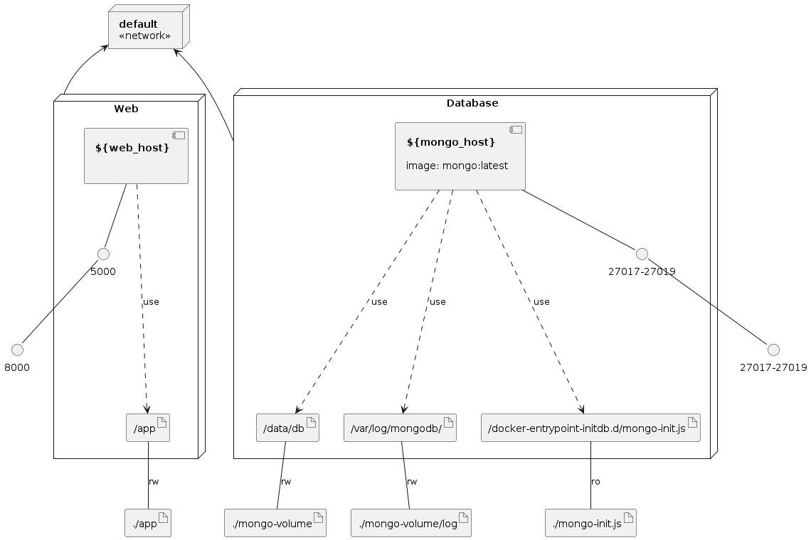

# Python-Flask-MongoDB-with-Docker-Compose
Launching Tech Stack in order to Python, Flask Framework and MongoDB with Docker Compose. For this documentation, I have an interesting full article that I recommend you [Python, Flask, MongoDB with Docker Compose](https://www.crashell.com/estudio/python_flask_y_mongodb_con_docker_compose).

### Infrastructure model



## Execution this Docker Compose.

First, making clone to this project, doing: 

```bash
git clone https://github.com/jersonmartinez/Python-Flask-MongoDB-with-Docker-Compose.git
```

And then, execute the Docker Compose instruction to launch Tech Stack (`Python`, `Flask` and `MongoDB`). 

```bash
docker-compose up -d
```

## Modify credentials for MongoDB Server

Update the file `.env` (environment variables) with your specify credentials. 

```bash
WEB_HOST=cs_api

MONGO_HOST=cs_mongodb
MONGO_PORT=27017
MONGO_USER=root-crashell
MONGO_PASS=password-crashell
MONGO_DB=db_crashell
```

Other important file is `mongo-init.js`.

```javascript
db.createUser(
    {
        user: 'root-crashell',
        pwd: 'password-crashell',
        roles: [
            { role: "clusterMonitor", db: "admin" },
            { role: "dbOwner", db: "db_name" },
            { role: 'readWrite', db: 'db_crashell' }
        ]
    }
)
```

## Runnnig containers and showing results.

This result is using the `curl` tool.

```bash
$ curl 127.0.0.1:8000
<h1 style="background-color: #262626; color: white; padding: 20px; text-align:center;">Hello, Crashell!</h1>
```

Result using the browser.


## Testing MongoDB Connection as an API

Execute the following instruction using `curl` or the browser.

```bash
$ curl 127.0.0.1:8000/api

"Connected to the MongoDB Server!"
```

Result using the browser.


## Other instructions

#### Remove volumes
We have two ways to remove our volumes with Docker.

First is using `prune` command.

```bash
docker volume prune -f
```

Second is using the current command `volume rm` with `-f` like parameter.

```bash
docker volume rm $(docker volume ls -q)
```

#### Clean up MongoDB volume and Cache for Python

```bash
rm -rf mongo-volume app/__pycache__/ && mkdir mongo-volume
```

#### Delete cache in Docker System

```bash
docker system prune -a -f && docker builder prune -a -f
```

### Recreate container web

```bash
docker-compose up --build --force-recreate --no-deps -d web
```

### Show logs of API Execution

```bash
docker logs --tail 1000 -f cs_api
```
